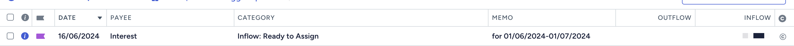

# ynab-uncleared-interest

This Cloudflare Worker / Node.JS script adds uncleared earned interest to an YNAB account, so you can track how much you've accrued before it's actually paid out.

# Getting started

1. Run `yarn install`
2. Copy `.dev.vars.example` to `.dev.vars`
3. Either run `yarn start` or `yarn deploy` depending on whether you want to run once-off or deploy to cloudflare workers to run hourly
